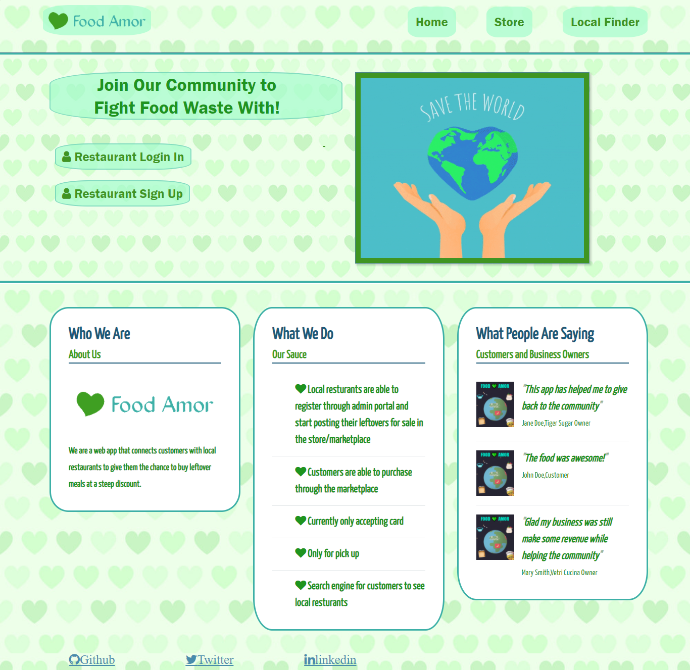
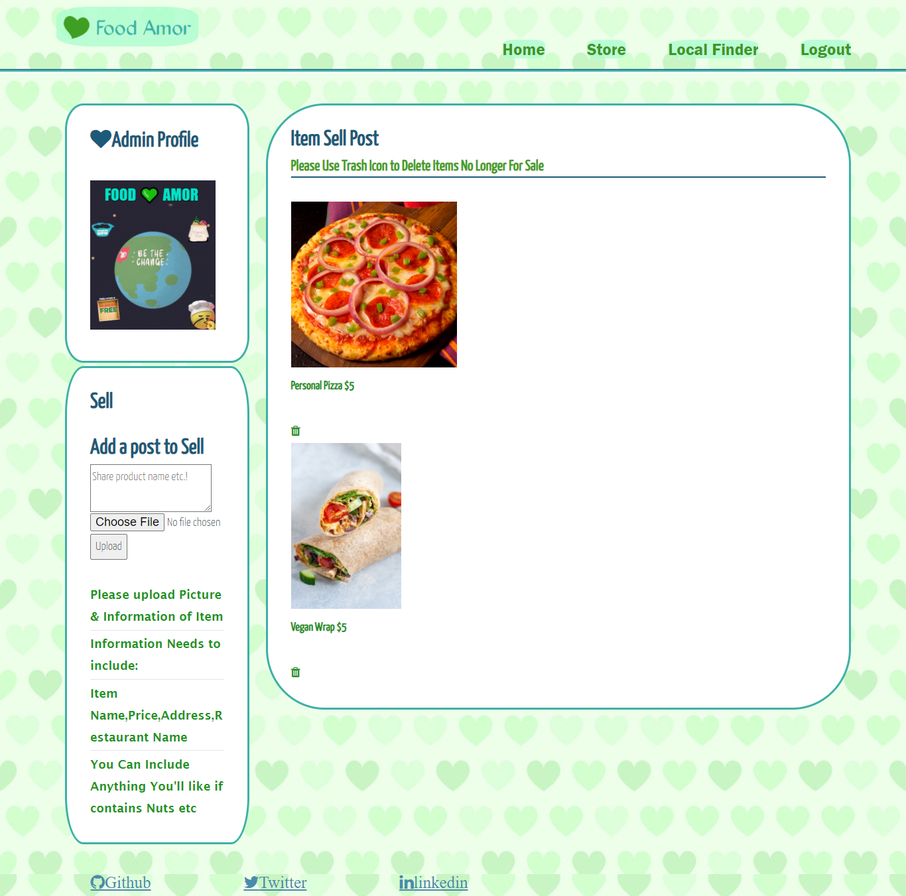
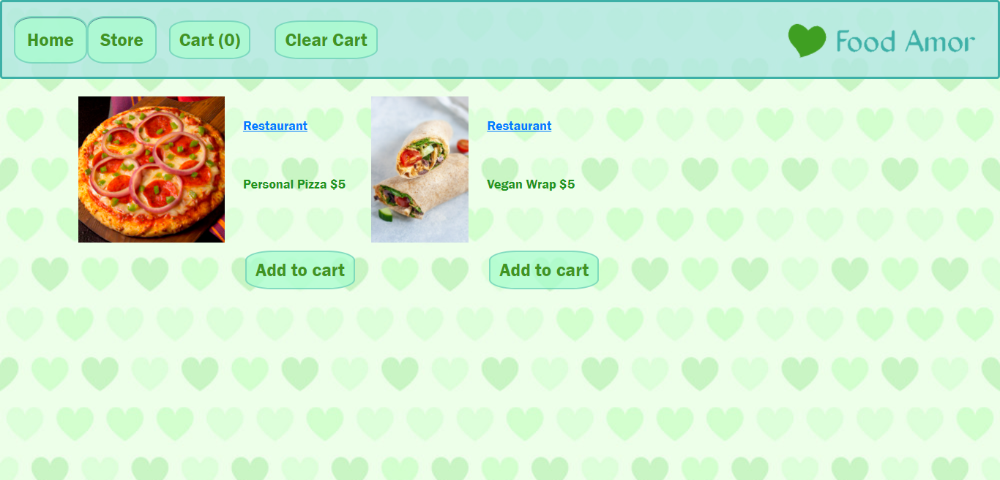
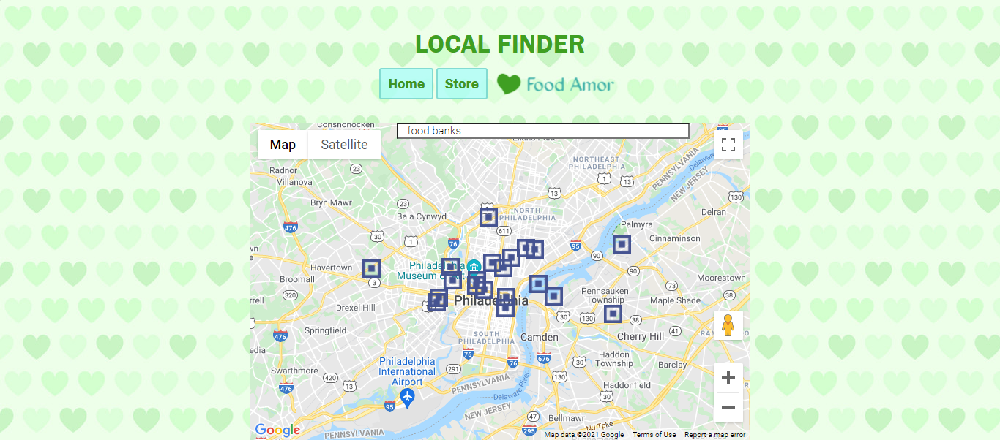
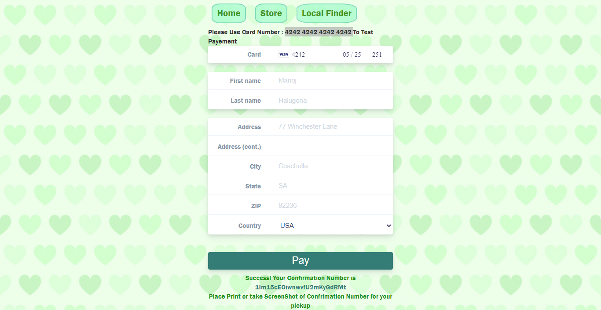

# Food Amor
Full Stack Application that is meant to connect customers with local restaurants to give them the chance to buy leftover meals at a steep discount.

## Heroku Link
https://food-amor.herokuapp.com/

### Tech Used: HTML , CSS , JS , Node.js , MongoDB , Multer , Express , EJS, Google Maps API,Stripe API

##HomePage

##Restaurant Profile 

## Store

## LocalFinder(Food Banks)

## Pay

## Installation

1. Clone repo
2. run `npm install`

## Usage

1. run `node server.js`
2. Navigate to `localhost:8080`

